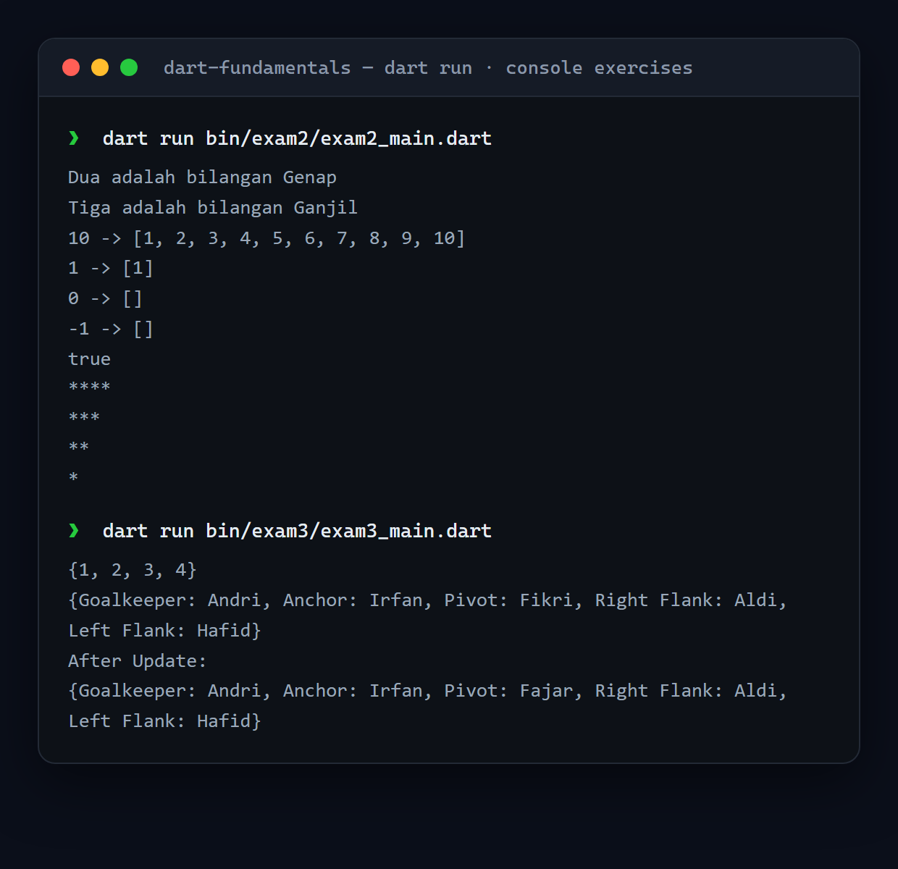

# Dart Fundamentals

Console exercises from Dicoding's *Belajar Pemrograman Dart* — control flow, collections, functions, and OOP — each with its own unit tests.

<p align="center">
  
</p>

## Exercises

Each exercise lives in `a191-dart-code-submission/bin/examN/` with a matching test in `test/`:

| Exam | Focus |
|---|---|
| 1 | Command-line arguments |
| 2 | Conditionals, loops, collections |
| 3 | Sets & maps |
| 4 | Classes & string interpolation |

## Run it

```bash
cd a191-dart-code-submission
dart pub get
dart run bin/exam2/exam2_main.dart
dart test                 # run all exercise tests
```

## Tech stack

Dart

## Notes

Submission for Dicoding's *Belajar Pemrograman Dart* (course a191).
